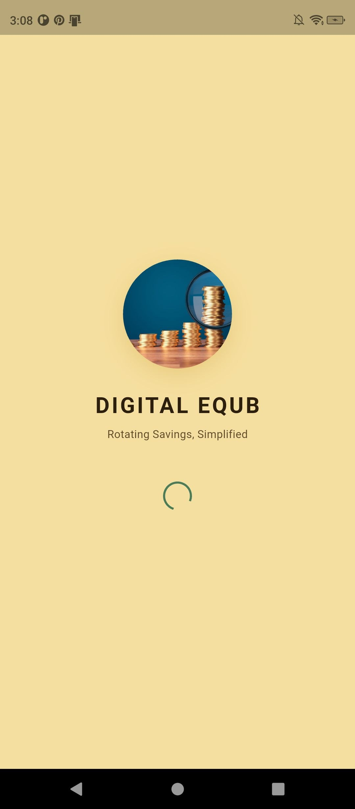
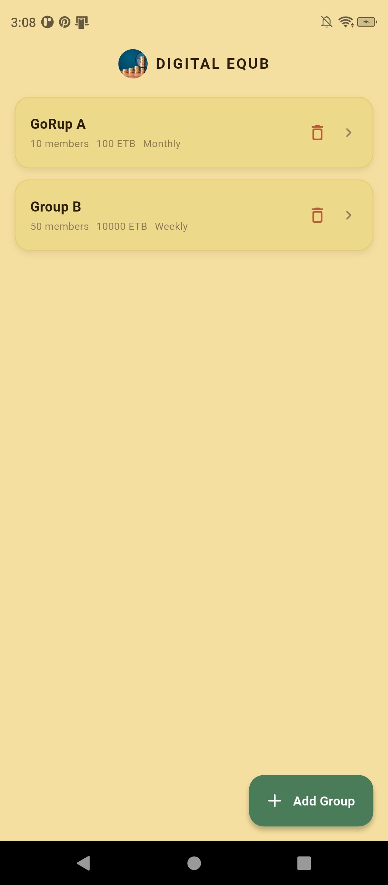
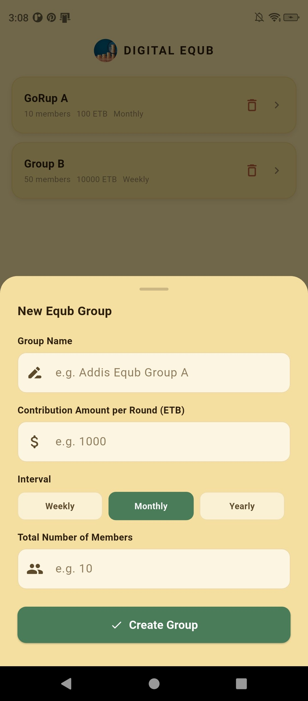
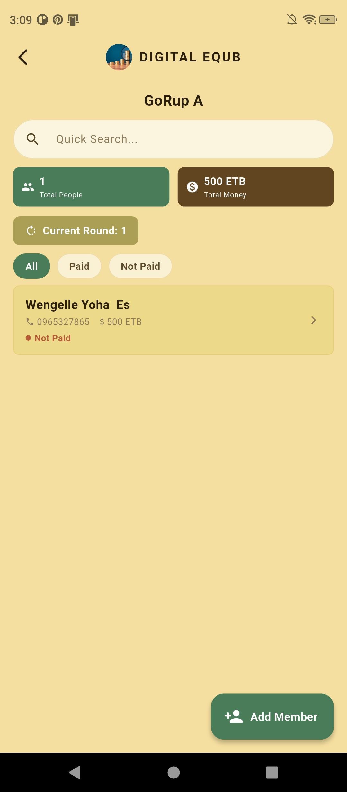
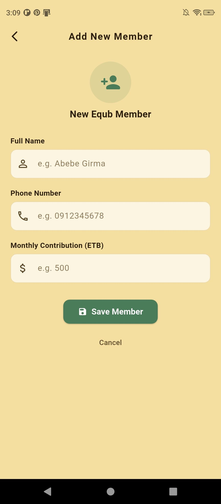
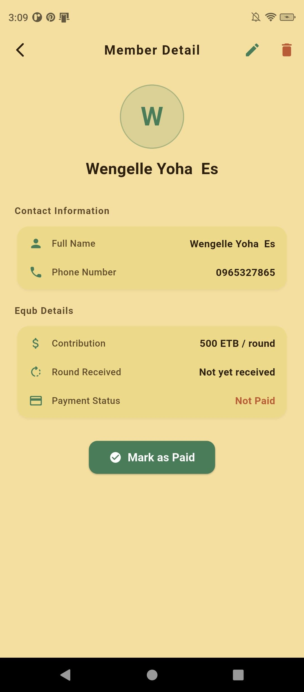
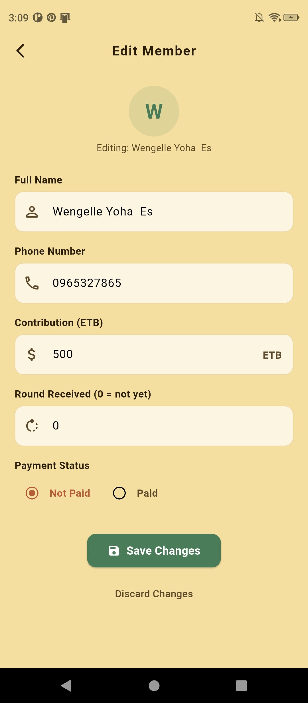
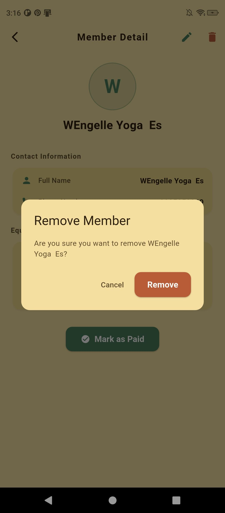

# Digital Equb

A Flutter application for managing **Equb** — a traditional Ethiopian rotating savings system where a group of people each contribute a fixed amount every round, and one member receives the full pool per cycle.

---

## Author

**[wengelle yohannes . ugr/2568/16 . sec 2]** — Digital Equb · Flutter Assignment

## Screenshots

### intro Screen



### group list Screen




### Home Screen



### member details , creating, editing and deletion






---

## Features

**CREATE** Add new Equb groups · Add members to a group

**READ** View all groups · View members per group · Search by name or phone · Filter by Paid /NotPaid

**UPDATE** Edit member info · Mark member as Paid · Change round received · Update payment status via radio buttons

**DELETE** Remove a group · Remove a member with confirmation

---

---

## Tech Stack

| Tool                   | Purpose                           |
| ---------------------- | --------------------------------- |
| **Flutter**            | UI framework                      |
| **Provider**           | State management                  |
| **http**               | Network requests to MockAPI       |
| **shared_preferences** | Local group storage on device     |
| **MockAPI**            | Free REST API backend for members |

---

## API Endpoints Used

| Method   | Endpoint       | Description                                    |
| -------- | -------------- | ---------------------------------------------- |
| `GET`    | `/members`     | Fetch all members (filtered by groupId in app) |
| `POST`   | `/members`     | Create a new member                            |
| `PUT`    | `/members/:id` | Update a member                                |
| `DELETE` | `/members/:id` | Delete a member                                |

---

---

## How It Works

### App Flow

```
intro screen → Groups Screen → tap a group → Home Screen (that group's members)
```

### Groups

- Created and stored locally on the device using shared_preferences
- Each group has a name, contribution amount, interval (Weekly / Monthly / Yearly), and total member count
- Tap a group card to enter its member list
- Delete a group with the trash icon on the card

### Members

- Stored in MockAPI — fully persistent in the cloud
- Each member carries a `groupId` so they belong to exactly one group
- Filter members by All / Paid / Not Paid using the chips on the home screen

### Round System

- Each round = one payout cycle
- `roundReceived` tracks which round a member received their payout
- **Current Round** shown on home = highest round received + 1

---
